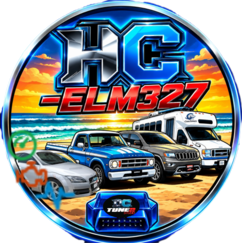

  

# DC-ELM327

Aplicación Android para diagnóstico vehicular mediante adaptadores ELM327. Permite conectarse por **Bluetooth, USB o Wi‑Fi**, leer y borrar códigos de falla, consultar datos en vivo, visualizar gráficas y revisar información del vehículo desde el teléfono.

## Descarga

[**Descargar DC-ELM327 v3.0.4 — APK firmado**](https://github.com/dcg0/dc-elm-327/releases/download/v3.0.4/DC-ELM327-v3.0.4-release.apk) · [Verificar SHA-256](https://github.com/dcg0/dc-elm-327/releases/download/v3.0.4/DC-ELM327-v3.0.4-release.apk.sha256)

La aplicación requiere un adaptador ELM327 compatible. Después de descargar el APK, habilita la instalación desde esta fuente en Android si el sistema lo solicita.

### Verificación de seguridad

- **SHA-256 de la APK publicada:** `336d7a9adadfd3bc05c1d8a654e7a6c3fb1980a8cd360ea23bfd19e29bbfdb11`
- La APK fue compilada como **Release**, sin minificación R8 para mejorar la compatibilidad de arranque, firmada con la clave de producción y verificada con Android Signature Scheme v1, v2 y v3.
- La APK publicada y la compilada localmente tienen el mismo SHA-256.
- La aplicación requiere Android 6.0 (API 23) o posterior y apunta al SDK objetivo configurado para esta release.

## Documentación

#### Connection types
* Bluetooth
* USB
* Wi-Fi

#### Functionality

* Read fault codes
* Clear fault codes
* Read/record live data
* Read freeze frame data
* Read vehicle info data

  
Expand features list

  
#### Additional features

* Day/Night view
* Data charts
* Dashboard
* Head up display
* Save recorded data
* Load recorded data (for analysis)

## Screenshots

| Functions | OBD data | Dashboard |
| :--: | :--: | :--: |
|  | 
## Contribute
  * Report issues in the [issue tracker](https://github.com
  * Create a [Pull Request](https://docs.github.com/en/pull-requests)
  * Test the app with different devices, alpha & beta releases are posted in the Telegram [AndrOBD release channel]
  * Contribute to development of plugin extensions: [repository](https://github.com
  * Discuss the project in the [Telegram](https://t.me/joinchat/G60ltQv5CCEQ94BZ5yWQbg) or [Matrix](https://matrix.to/#/#AndrOBD:matrix.org) chat rooms
  * Translate this app into more languages on [Weblate](https://hosted.web or have a look at [Language translation](https://github.com section in the Wiki for more info.

  
Expand translation status

#### App dialogs:

[![App strings]

#### OBD data descriptions:

), *Java & Kotlin [can be used](https://github.com/Android/wiki/Frequently-asked-questions#what-programming-languages-can-be-used-for-contributions)*. Contributers will be credited/linked in the Readme.

## Support by donating

Buy us a coffee or donate in the amount that you see valuable for the project,

#### Credits
DC laboratory

*Thanks to the open source community and any supporters who pick this project up, DC lab will be able to get more development, new features, and hopefully even more than that.*
DC laboratorio 

---
DC
## Autoría y descarga

**Autor:** [DC Laboratory](https://dcg0.github.io/DC-laboratory/)

[Descargar DC-ELM327 v3.0.3 — APK firmado](https://github.com/dcg0/dc-elm-327/releases/download/v3.0.3/DC-ELM327-v3.0.3-release.apk)
